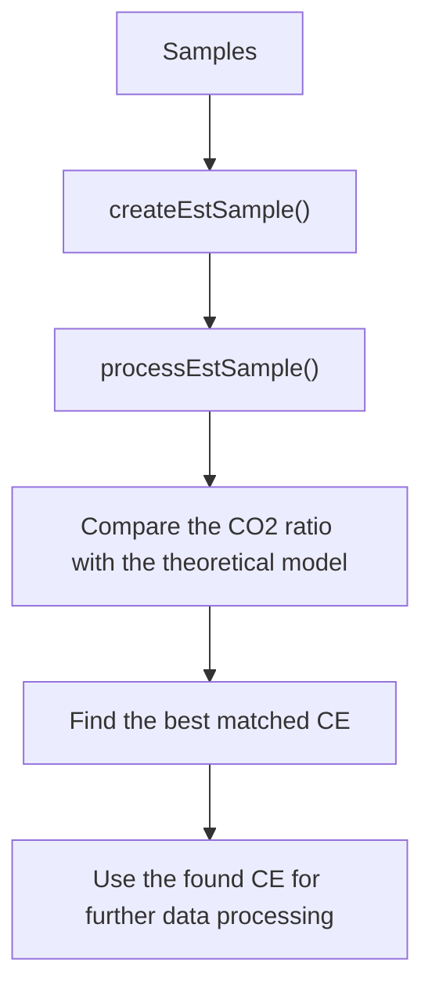
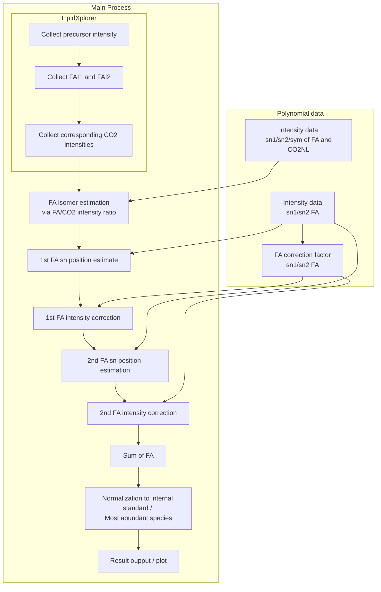
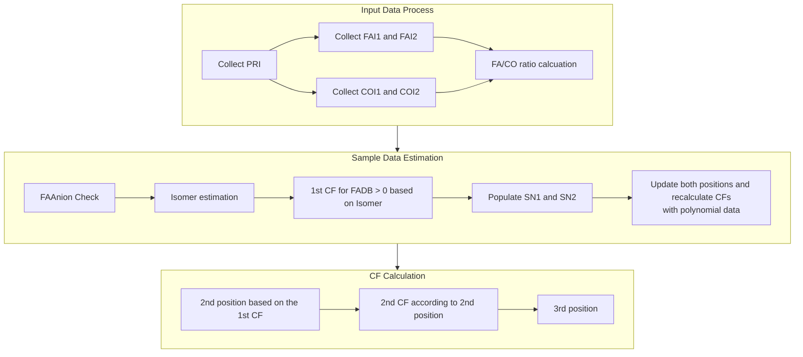

Workflow
==

## 1. Machine performance check

### Purpose:
* LipidXte2 evaluates the mass spectrometer performance by comparing fragment intensity ratios CO2 neutral loss (COI) and fatty acid anion (FAI) for measurements and theoretical reference data.
* Identifies ideal instrument settings for accurate lipid quantification.

### Key Actions:

1. Retrieves data:
   1. Accesses experimental data, reference database, and user-defined parameters.

1. Iterates through samples and parameter combinations:
   1. Processes samples in groups based on user-defined criteria.
   1. Iterates through different NCE (normalized collision energy) offsets for each group.

1. Calculates COI/FAI ratios for estimated samples:
   1. Calls a helper function to process estimated samples and extract relevant COI/FAI data.
   1. Organizes COI/FAI ratios for each NCE offset.

1. Retrieves theoretical COI/FAI ratios:
   1. Retrieves reference COI/FAI ratios for specific lipid classes and NCE values from a master database.

1. Compares estimated and theoretical ratios:
   1. Calculates R-squared values to assess the correlation between estimated and theoretical COI/FAI ratios for each NCE offset.

1. Stores and analyzes results:
   1. Saves performance scores (R-squared values and averages) for each combination of group and NCE offset.
   1. Identifies the best-performing NCE offset for each group.
   1. Exports final results to a file, including the best-performing settings overall.

### SRS Considerations:
1. Emphasize the importance of machine performance evaluation for accurate lipidomics results.
1. Define key terms like NCE, COI/FAI ratios, and R-squared for clarity.
1. Include a glossary or appendix for specialized terms if the SRS audience is diverse.
1. Describe the potential impact of machine performance on experimental outcomes.

## 2. Create estimated samples **<Title could be a bit more specific/explainatory>**

### Purpose:

* The primary purpose of the code is to create estimated samples (EstSample objects) from input data, utilizing a Master Database and other relevant information.
* It performs calculations, estimations, and CF (Correction Factor) updates to generate these estimated samples.

### Key Inputs:

* MasterDatabase: A database containing reference data.
* groupKey: A string representing a group identifier.
* sampleId: A string identifying the sample being processed.
* species: A collection of TreeItem<BARow> objects, containing information about species and their fractions.
* baMap: A map associating TreeItem<BARow> objects with their corresponding BA (Base Anion) objects.
* mFaAnionsList: An observable list of FAAnion objects, likely containing information about fatty acid anions.
* noCorrection: A boolean flag indicating whether TXCF (Transmission Correction Factor) should be applied.

### Key Outputs:

* estSampleTreeMap: A TreeMap storing EstSample objects, representing the estimated samples generated by the code.

### General Functionality:

1. Prepares Reference Data:
   1. Creates a referenceFAIMap if needed, likely used for reference FAI values.

1. Iterates through Species and Fractions:
   1. Loops through input species and their fractions.
   1. Processes symmetric and non-symmetric cases differently.
   1. Identifies relevant information (mass, class, etc.).
   1. Creates EstSample objects for each combination of species, fraction, and NCE.
   1. Retrieves theoretical intensities for CO2 and FA fragments from the Master Database.
   1. Applies TX CF if required.
   1. Calculates CO2 to FA fragment intensity ratios.

1. Estimates FA-Isomers and Updates Correction Factors: **<is FA isomer correct here?>**
   1. Performs initial FA isomer estimation.
   1. Updates correction factors based on calculations by using polynomial data.
   1. Handles cases with multiple fragments (for sn-1 and sn-2 FA).
   1. Estimates positions for symmetric cases.

1. Returns Estimated Samples:
    1. Returns the estSampleTreeMap containing the generated estimated samples.

## 3. Process estimated samples

### Purpose:

* Processes a sample for a lipidomics experiment, calculating various metrics and preparing data for display.

### Key Steps:

1. Computes reference PRI (precursor ion intensity) sums:
   1. Iterates through species and samples.
   1. Calculates reference PRI sums for each class (e.g., PC, PE).
   1. Stores sums in designated maps for later use.

1. Applies TXCF if applicable:
   1. Adjusts FAI and COI values based on TXCF for specific species and NCE values.

1. Calculates n-PRI-x:
   1. Iterates through species and samples.
   1. Calculates n-PRI-x (a normalization factor) for each detected mass and NCE combination.
   1. Stores n-PRI-x values for later use.

1. Retrieve CF (correction factors) from polynomial data:
   1. Iterates through species and samples.
   1. Retrieve CF (a correction factor for FAI) for the corresponding number of carbon atoms, double bonds, location and NCE combination.
   1. Stores CF values in a fragment map.

1. Normalizes FAI and COI data:
   1. Normalizes FAI and COI values using calculated CF values.

1. Creates FASamples:
   1. Creates FASample objects representing individual lipids and their associated data (mass, intensity, normalized FAI/COI, etc.).
   1. Handles potential isomer splits based on certain criteria.

1. Merges data for identical lipids:
   1. Combines data from FASamples representing the same lipid species.

1. Prepares data for display:
   1. Organizes calculated data and FASamples into appropriate structures for visualization.
   1. Passes these structures to a control object for display setup.

