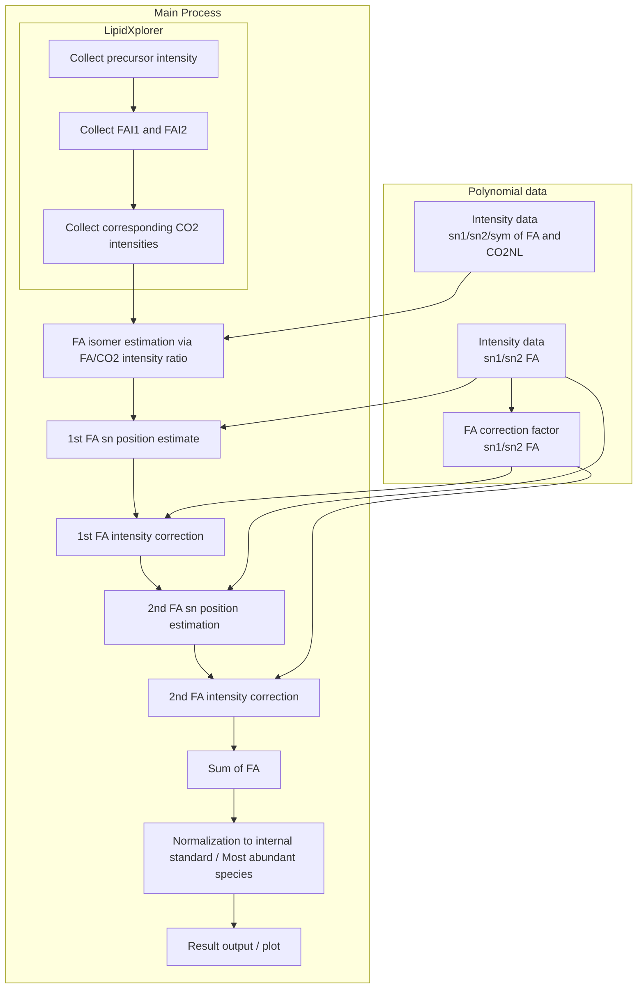

Workflow
==

## Summary

The main process automates the complex process of lipid identification and quantification from mass spectrometry data. It takes raw data, reference databases, and user-defined parameters to generate estimated sample information, ultimately enabling researchers to understand the lipid composition of their samples.

### Key Functionalities:

#### 1. Data Input and Preparation:

Takes as input:
- Raw mass spectrometry data (represented by TreeItem<BARow>, BA, Sample objects).
- A polynomial database of known lipids (PolynomialDatabase, FAAnion).
- User-defined parameters (e.g., collision energy (CE), transmission correction function).
- Organizes and prepares the input data for processing. This includes creating maps of species, fractions, and estimated samples.

#### 2. Lipid Identification and Quantification:

- Iterates through different lipid species and collision energies (CEs).
- For each lipid and CE combination:
   - Retrieves theoretical intensities from the polynomial database.
   - Calculates various lipid-related parameters (e.g., CF (correction factor), isomer ratios, relative FAI (fatty acid intensity)).
   - Applies transmission correction if specified.
   - Estimates the position of fatty acids within the lipid molecule (SN1, SN2).
   - Performs complex calculations to correct for various factors influencing the measurements

#### 3. Correction Factor Calculation and Application:

- Calculates correction factors (CFs) to account for variations in ionization efficiency and other experimental artifacts.
  Applies these correction factors to the estimated FAI values. This is a multi-step process, with different CFs calculated and applied at different stages of the analysis.

#### 4. Isomer Estimation:

- Estimates the relative abundance of different isomers of a given lipid. This is a crucial step, as isomers can have different biological activities.

#### 5. Data Normalization:

- Normalizes the data to account for variations in sample size and other factors.

#### 6. Data Output and Visualization Preparation:

- Prepares the processed data for visualization and further analysis. This includes generating data structures that can be used by charting and analysis tools.
- Provides a ChartControl interface to allow for custom visualization implementations.

#### 7. Helper Functions:

- Contains numerous helper functions for specific tasks, including:
   - Retrieving data from the database.
   - Calculating regression parameters.
   - Estimating isomer ratios.
   - Applying transmission correction.
   - Performing data normalization.

## Core Process Description

### Purpose:

* The primary purpose of the core process is to create estimated samples (EstSample objects) from input data, utilizing the polynomial data and other relevant information.
* It performs calculations, estimations, and CF (Correction Factor) updates to generate these estimated samples.

### Key Inputs:

* PolynomialDatabase: A database containing reference data generated by the polynomials.
* groupKey: A string representing a group identifier.
* sampleId: A string identifying the sample being processed.
* species: A collection of TreeItem<BARow> objects, containing information about species and their fractions.
* baMap: A map associating TreeItem<BARow> objects with their corresponding BA (Base Anion) objects.
* mFaAnionsList: An observable list of FAAnion objects, likely containing information about fatty acid anions.

### Key Outputs:

* estSampleTreeMap: A TreeMap storing EstSample objects, representing the estimated samples generated by the code.

### General Functionality:

1. Intialization:
   1. Creates a referenceFAIMap if needed, likely used for reference FAI values.

1. Data iteration and Fraction Splitting:
   1. Loops through input species and their fractions.
   1. Processes symmetric and non-symmetric cases differently.
   1. Identifies relevant information (mass, class, etc.).
   1. Creates `EstSample` objects for each combination of species, fraction, and NCE.
   1. Retrieves theoretical intensities for CO2 and FA fragments from the PolynomialDatabase.
   1. Applies TX CF if required.
   1. Calculates CO2 to FA fragment intensity ratios.

1. Sample Estimation:
   1. Performs initial FA isomer estimation.
   1. Updates correction factors based on calculations by using the PolynomialDatabase.
   1. Handles cases with multiple fragments (for sn-1 and sn-2 FA).
   1. Estimates positions for symmetric cases.

1. Isomer Estimation and Correction Factor Calculation:
   1. Calls estimateIsomer to estimate the relative abundance of different isomers of the lipid.
   1. Calls updateCorrectionFactor to calculate and apply correction factors.
   1. For lipids with multiple fatty acid components, calls updateCorrectionFactorsWithPosition, estimate2ndPosition, and estimate3rdPosition to refine the correction factors and estimate the positions of the fatty acids within the lipid molecule (SN1, SN2).
   1. For symmetric lipids, sets the relative FAI and position information directly.

1. Returns Estimated Samples:
    1. Returns the estSampleTreeMap containing the generated estimated samples.

